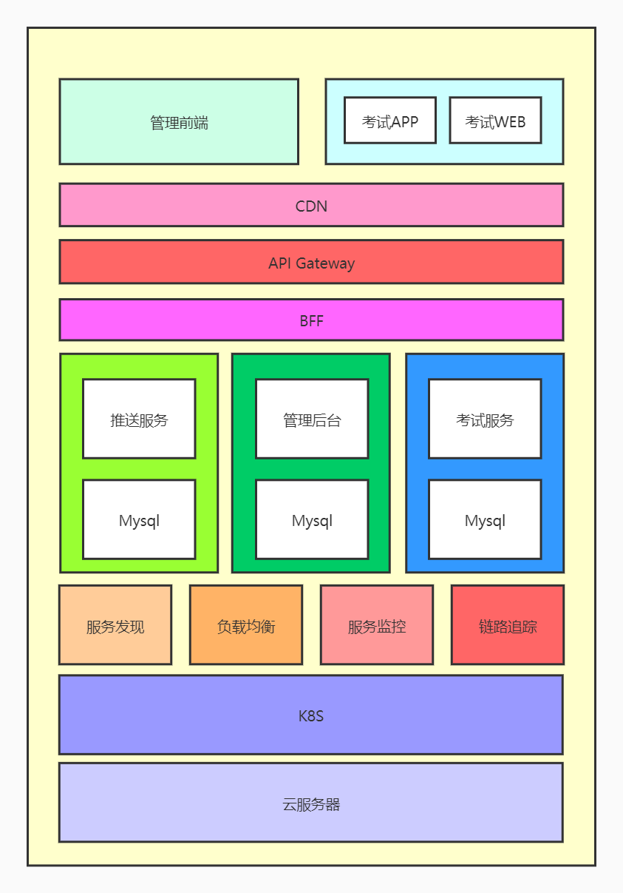
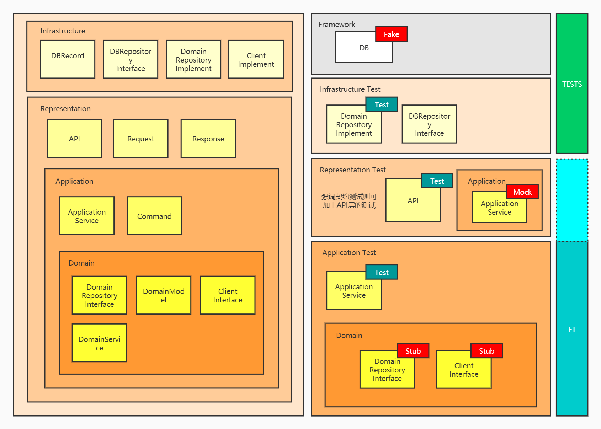
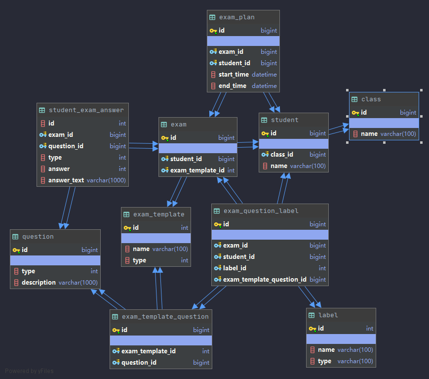
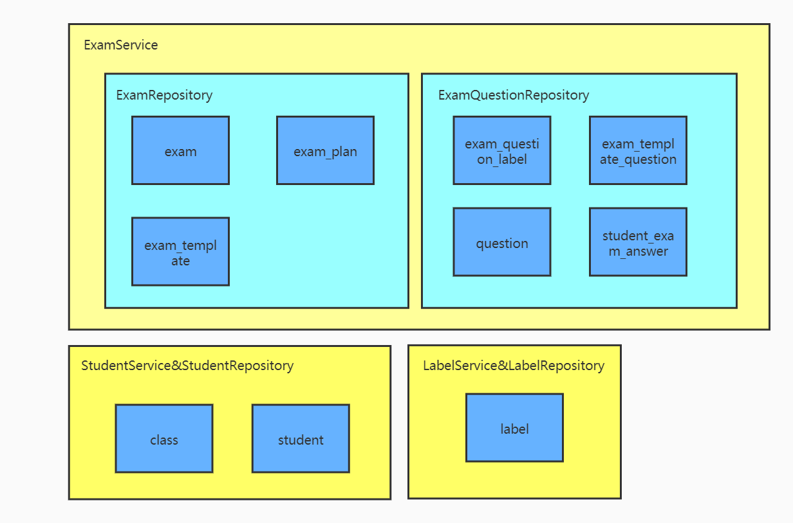

# 技术栈
* Kotlin
* Micronaut Framework
* Mysql
* H2
* Kotlin Test
* Docker
# 系统架构

# 架构与工序

关于Test目录
```
test目录下分为3个子目录:
    -application 
    -infrastructure 
    -representation
分别对应3种测试，其中representation为API测试，也可以和application测试合并
其中infrastructure启动了框架的上下文，通过配置将Mysql Fake成了H2内存数据库
```
关于接口的Stub
```
Stub的接口均可在Test目录下自行实现，通过@Replaces注解实现接口的Stub，见application目录下的stub目录
```
关于外部系统的Fake
```
DB:通过H2（或者Mariadb4j）内存数据库来替代mysql，或者通过docker启动mysql实例
API:通过SpringCloudContract实现，见contracts目录，或搭建内网YApi系统
```
# E-R图

# 领域模型

# 名词解释
* exam-templates 试卷的模板，模板上含有试卷的试题
* exam 试卷关联模板id，每个学生每场考试都有唯一的examId
# API通用鉴权
```
Http Header：
{
    "Authorization":{jwt}
}
通过jwt可以获取studentId
```
# STORY
|  As   | I would like to  | so that|
|  ----  | ----  | ----  |
| student  | 我需要知道所有科目考试的安排 | 我知道我什么时候去考什么科目
| student  | 我可以提交并修改答案 | 我可以在考试结束前修改我提交的答案
| student  | 我需要能给题目快速打标签 | 我可以随时跳转到标记的题目，不需要我慢慢翻找
# Task
## 统一鉴权
* 当学生没有携带token请求时，应该提示未登录401
```
例如没有请求头
```
* 当学生携带token请求时，应该可以获取到studentId
```
Http Header：
{
    "Authorization":{合法jwt}
}
解析jwt可以获取studentId
```
* 当学生携带token请求时，获取到studentId，但用户不存在，应该返回401
```
Http Header：
{
    "Authorization":{合法jwt}
}
解析jwt可以获取studentId

Application Test：
    stub StudentRepositoryInterface -> StudentRepositoryInterface::findStudentById返回null
    StudentService::getStudent() 抛出异常

Infrastructure Test：fake db
    student表是个空表，StudentRepository::findStudentById返回null
```
* 当学生携带过期token请求时，应该返回token过期，402
```
Http Header：
{
    "Authorization":{过期jwt}
}
```
* 当学生携带错误token登录时，应该返回401
```
Http Header：
{
    "Authorization":{乱写的jwt}
}
```
## 我需要知道所有科目考试的安排
获取考试日程安排 
```
API GET /exams-calendar?year={year}&month={month}
ResponseBody:
{
    "code":0,
    "msg":"OK",
    "data":{
        "calendar":[
            {
                "examName":"",
                "starTime":"",
                "endTime":""
            }
        ]
    }
}
```
* 如果year，mouth参数不合法，则返回错误
```
> 例如，mouth参数为13，当试图提交请求时，应该提示参数错误
    > GET /exams-calendar?year=2020&month=13，当mouth大于12时，返回错误
```
* 如果输入正确则返回该考生的考试日程安排
```
> 例如，mouth参数为1，当提交请求时，返回该考生的考试日程安排
    > GET /exams-calendar?year=2020&month=1

Application Test：
    stub ExamRepositoryInterface -> ExamRepositoryInterface::findExamsByStudentIdAndStartTimeEndTime()返回：
        [
            {
                "exam":{
                    "id":1,
                    "studentId":1,
                    "examTemplateId":1
                },
                "examPlan":{
                    "id":1,
                    "examId":1,
                    "studentId":1,
                    "starTime":"2020/01/20 08:00:00",
                    "endTime":"2020/01/20 09:00:00"
                },
                "examTemplate":{
                    "id":1,
                    "name":"test1",
                    "type":1
                }
            }
        ]
    ExamService::findExamsByStudentIdMouth(1,1)返回：
        [
            {
                "examName":"test1",
                "examType":1,
                "starTime":"2020/01/20 08:00:00",
                "endTime":"2020/01/20 09:00:00"
            }
        ]

Infrastructure Test：fake db
    exam表插入:
        {
            "id":1,
            "studentId":1,
            "examTemplateId":1
        }
    examPlan表插入:
        {
            "id":1,
            "examId":1,
            "studentId":1,
            "starTime":"2020/01/20 08:00:00",
            "endTime":"2020/01/20 09:00:00"
        }
    examTemplate表插入:
        {
            "id":1,
            "name":"test1",
            "type":1
        }
    ExamRepositoryImplement::findExamsByStudentIdAndStartTimeEndTime(1,"2020/01/20 00:00:00","2020/01/20 23:59:59")返回
        [
            {
                "exam":{
                    "id":1,
                    "studentId":1,
                    "examTemplateId":1
                },
                "examPlan":{
                    "id":1,
                    "examId":1,
                    "studentId":1,
                    "starTime":"2020/01/20 08:00:00",
                    "endTime":"2020/01/20 09:00:00"
                },
                "examTemplate":{
                    "id":1,
                    "name":"test1",
                    "type":1
                }
            }
        ]
```
## 我可以修改答案,我可以在考试结束前修改我提交的答案
提交/修改答案
```
API Put /exams/{eid}/questions/{qid}/answer
RequestBody:
{
    "type":1,
    "answer":1
    "answer_text":""
}
ResponseBody:
{
    "code":0,
    "msg":"OK"
}
```
* 如果exam不存在则返回404
```
> 例如，eid为1，当试图提交请求时，应该提示exam不存在
    > Put /exams/1/questions/1/answer

Application Test：
    stub ExamRepositoryInterface -> ExamRepositoryInterface::findExamById(1)返回null
    ExamService::answer()抛出ExamNotExist异常

Infrastructure Test：fake db
    exam表插入id为2的数据
    ExamRepositoryImplement::findStudentById(1)返回null
```
* 如果exam不属于student则返回401
```
> 例如，studentId为1，eid为1，当试图提交请求时，应该提示不合法
    > Put /exams/1/questions/1/answer

Application Test：
    stub ExamRepositoryInterface -> ExamRepositoryInterface::findExamById(1)返回
        {
            "exam":{
        
            },
            "student":{
                "id":2
            }
        }
    ExamService::answer()抛出StudentNotMatch异常

Infrastructure Test：fake db
    exam表插入id为1，studentId为2的数据
    ExamRepositoryImplement::findExamById(1)返回:
        {
            "exam":{
        
            },
            "student":{
                "id":2
            }
        }
```
* 当question不属于exam则返回400
```
> 例如，eid为1，qid为1，当试图提交请求时，应该提示不合法
    > Put /exams/1/questions/1/answer

Application Test：
     stub ExamRepositoryInterface -> ExamRepositoryInterface::findExamById(1)返回
        {
            "exam":{
        
            },
            "student":{
                "id":2
            },
            "questions":[
                {
                    "id":2
                }
            ]
        }
     ExamService::answer()抛出QuestionNotMatchExam异常

Infrastructure Test：fake db
    exam表插入{"id":1,"exam_template_id":1}
    exam_tempalte表插入{"id":1}
    exam_template_question表插入{"id":1,"exam_template_id":1,"question_id":2}
    ExamRepositoryImplement::findExamById(1)返回
        {
            "exam":{
        
            },
            "student":{
                "id":2
            },
            "questions":[
                {
                    "id":2
                }
            ]
        }
```
* 如果提交时间早于exam开始的时间则返回400
```
> 例如，提交的时间在exam开始时间之前，当试图提交请求时，应该提示不合法
    > Put /exams/1/questions/1/answer

Application Test：
    stub ExamRepositoryInterface -> ExamRepositoryInterface::findExamById(1)返回
        {
            "examPlan":{
                "startTime":"2022/12/20 00:00:00",
                "endTime":"2022/12/21 00:00:00"
            }
        }
    ExamService::answer()抛出ExamNotStart异常

Infrastructure Test：fake db
    exam表插入{"id":1}
    exam_plan表插入{"id":1,"exam_id":1,"start_time":"2022/12/20 00:00:00","end_time":"2022/12/21" 00:00:00}
    ExamRepositoryImplement::findExamById(1)返回
        {
            "examPlan":{
                "startTime":"2022/12/20 00:00:00",
                "endTime":"2022/12/21 00:00:00"
            }
        }
```
* 如果提交时间迟于exam结束的时间则返回400
```
> 例如，提交的时间在exam开始结束之后，当试图提交请求时，应该提示不合法
    > Put /exams/1/questions/1/answer

Application Test：
    stub ExamRepositoryInterface -> ExamRepositoryInterface::findExamById(1)返回
        {
            "examPlan":{
                "startTime":"1990/12/20 00:00:00",
                "endTime":"1990/12/21 00:00:00"
            }
        }
    ExamService::answer()抛出ExamIsEnd异常

Infrastructure Test：fake db
    exam表插入{"id":1}
    exam_plan表插入{"id":1,"exam_id":1,"start_time":"1990/12/20 00:00:00","end_time":"1990/12/21 00:00:00"}
    ExamRepositoryImplement::findExamById(1)返回
        {
            "examPlan":{
                "startTime":"1990/12/20 00:00:00",
                "endTime":"1990/12/21 00:00:00"
            }
        }
```
* 如果在正确的时间内，则允许多次提交，并每次都覆盖上一次的提交
```
> 例如，提交的时间在规定的时间，当试图提交请求时，应该提示提交成功
    > Put /exams/1/questions/1/answer

Application Test：
    stub ExamRepositoryInterface -> ExamRepositoryInterface::saveAnswerByExamIdQuestionId()无返回
    ExamService::answer()无异常

Infrastructure Test：fake db
    ExamRepositoryImplement::saveAnswerByExamIdQuestionId(1,1,{"answer":1,"type":1,"answerText":""})
    StudentExamAnswerRepository::findAnswerByExamIdQuestionId(1,1)返回
        {
            "examId":1,
            "questionId":1,
            "answer":1,
            "type":1,
            "answerText":""
        }
```
## 我需要能给题目快速打标签,我可以随时跳转到标记的题目，不需要我慢慢翻找，标签名字相同则视为同一标签
### 获取考试可以打的标签
```
API Get /labels?type="exam"
ResponseBody:
{
    "code":0,
    "msg":"OK",
    "data":[
        {
            "id":1,
            "name":"困难"
        }
    ]
}
```
* 通过type返回对应的标签
```
> 例如，请求考试所能用的标签，应该返回对应的标签
    > Get /labels?type="exam"

Application Test：
    stub LabelRepositoryInterface -> LabelRepositoryInterface::findByType()返回
        [
            {
                "id":1,
                "type":"exam",
                "name":"test"
            }
        ]
    LabelService::getLabelByType()返回
        [
            {
                "id":1,
                "type":"exam",
                "name":"test"
            }
        ]

Infrastructure Test：fake db
    label表插入{"id":1,"name":"test","type":"exam"}
    LabelRepositoryImplement::findByType("exam")返回[
        [
            {
                "id":1,
                "type":"exam",
                "name":"test"
            }
        ]
```
### 给考题打标签
```
API Post /exams/{eid}/questions/{qid}/label
RequestBody:
{
  "labelIds":[1,2]
}
ResponseBody:
{
    "code":0,
    "msg":"OK"
}
```
* 如果exam不存在则返回404
```
同上
```
* 如果exam不属于student则返回401
```
同上
```
* 如果添加标签时间早于exam开始的时间则返回400
```
同上
```
* 如果添加标签时间迟于exam结束的时间则返回400
```
同上
```
* 如果question不属于这次exam则返回404
```
同上
```
* 如果labelId不存在则返回400
```
> 例如，labelIds传递的是不存在的值，应该返回400
    > Post /exams/1/questions/1/label
        RequestBody:
        {
          "labelIds":[2]
        }

Application Test：
    stub LabelRepositoryInterface -> LabelRepositoryInterface::findByType()返回
        [
            {
                "id":1,
                "type":"exam",
                "name":"test"
            }
        ]
    ExamService::setQuestionLabel() 报LabelNotExist异常

Infrastructure Test：fake db
    label表插入{"id":1,"name":"test","type":"exam"}
    LabelRepositoryImplement::findById(2)返回null
```
* 如果在正确的时间内，则为考题打标签成功
```
> 例如，前提条件都是正确的，则为考题打上lableId为1的标签
    > Post /exams/1/questions/1/label
        RequestBody:
        {
          "labelIds":[1]
        }

Application Test：
    stub ExamQuestionRepositoryInterface -> ExamQuestionRepositoryInterface::saveExamQuestionLabel()无异常
    ExamService::saveExamQuestionLabel() 无异常

Infrastructure Test：fake db
    ExamQuestionRepositoryImplement::saveExamQuestionLabel(1,1,[1])
    ExamLabel::findByExamIdQuestionId(1,1)返回
        [
            {
                "id":1,
                "examId":1,
                "examTemplateQuestionId":1,
                "labelId":1
            }
        ]
```
* 同一考题不能打上相同的多个标签，如果有相同名称则忽略这次操作
```
> 例如，为考题打上lableId为1的标签这个操作发生2次，应该只有1个label
    > Post /exams/1/questions/1/label
        RequestBody:
        {
          "labelIds":[1]
        }

Application Test：
    stub ExamQuestionRepositoryInterface -> ExamQuestionRepositoryInterface::saveExamQuestionLabel()无异常
    ExamService::saveExamQuestionLabel() 无异常

Infrastructure Test：fake db
    ExamQuestionRepositoryImplement::saveExamQuestionLabel(1,1,[1])
    ExamQuestionRepositoryImplement::saveExamQuestionLabel(1,1,[1])
    ExamLabel::findByExamIdQuestionId(1,1)返回
        [
            {
                "id":1,
                "examId":1,
                "examTemplateQuestionId":1,
                "labelId":1
            }
        ]
```

### 获取考题的标签
```
API Get /exams/{eid}/questions/{qid}/labels
ResponseBody:
{
    "code":0,
    "msg":"OK",
    "data":{
        "labelIds":[1,2]
    }
}
```
* 如果exam不存在则返回404
```
同上
```
* 如果exam不属于student则返回401
```
同上
```
* 如果question不属于这次exam则返回404
```
同上
```
* 如果question存在exam中，则返回question对应的labelIds
```
> 例如，获取考题的标签
    > Get /exams/1/questions/1/labels

Application Test：
    stub ExamQuestionRepositoryInterface -> ExamQuestionRepositoryInterface::getLabels()返回
        [
            {
                "id":1,
                "examId":1,
                "labelId":1,
                "examTemplateQuestionId":1
            },
            {
                "id":2,
                "examId":1,
                "labelId":2,
                "examTemplateQuestionId":1
            }
        ]
    ExamService::getExamQuestionLabelIds() 返回
        [1,2]

Infrastructure Test：fake db
    examLabelRepository::saveLabel({"id":1,"examId":1,"labelId":1,"examTemplateQuestionId":1})
    examLabelRepository::saveLabel({"id":2,"examId":1,"labelId":2,"examTemplateQuestionId":1})
    ExamQuestionRepositoryImplement::getLabels(1,1)返回
        [
            {
                "id":1,
                "examId":1,
                "labelId":1,
                "examTemplateQuestionId":1
            },
            {
                "id":2,
                "examId":1,
                "labelId":2,
                "examTemplateQuestionId":1
            }
        ]
```
### 为本次考卷的考题移除标签 
```
API Delete /exams/{eid}/questions/{qid}/label/{labelid}
ResponseBody:
{
    "code":0,
    "msg":"OK"
}
```
* 如果exam不存在则返回404
```
同上
```
* 如果exam不属于student则返回401
```
同上
```
* 如果question不属于这次exam则返回404
```
同上
```
* 如果question存在exam中，删除对应的labelId
```
> 例如，获取删除考题的标签
    > Delete /exams/1/questions/1/label/1

Application Test：
    stub ExamQuestionRepositoryInterface -> ExamQuestionRepositoryInterface::deleteLabel(1,1,1)返回无异常
    ExamService::deleteExamQuestionLabelById(1,1,1) 返回无异常

Infrastructure Test：fake db
    examLabelRepository::saveLabel({"id":1,"examId":1,"labelId":1,"examTemplateQuestionId":1})
    examLabelRepository::saveLabel({"id":2,"examId":1,"labelId":2,"examTemplateQuestionId":1})
    ExamQuestionRepositoryImplement::deleteLabel(1,1,1)
    ExamLabelRepository::getLabelByExamIdExamTemplateQuestionId(1,1)返回
        [
            {
                "id":2,
                "examId":1,
                "labelId":2,
                "examTemplateQuestionId":1
            }
        ]
```
### 获取本次考卷的所有标签
``` 
API Get /exams/{eid}/labels
ResponseBody:
{
    "code":0,
    "msg":"OK",
    "data":{
        “labels”:[
            {
                "examLabelId":1
                "labelId":1,
                "labelName":""
            }
        ]
    }
}
```
* 如果exam不存在则返回404
```
同上
```
* 如果exam不属于student则返回401
```
同上
```
* 前提条件正确则返回exam对应的labelIds
```
> 例如，获取本次考卷的所有标签
    > Get /exams/1/labels

Application Test：
    stub ExamQuestionRepositoryInterface -> ExamQuestionRepositoryInterface::getExamLabels(1)返回
        [
            {
                "examLabelId":1,
                "examId":1,
                "labelId":1,
                "examTemplateQuestionId":1,
                "labelName":"label1"
            },
            {
                "examLabelId":2,
                "examId":1,
                "labelId":2,
                "examTemplateQuestionId":2,
                "labelName":"label2"
            },
            {
                "examLabelId":3,
                "examId":1,
                "labelId":2,
                "examTemplateQuestionId":3,
                "labelName":"label2"
            }
        ]
    ExamService::getExamLabels(1) 返回
         [
             {
                 "examLabelId":1,
                 "labelId":1,
                 "labelName":"label1"
             },
             {
                 "examLabelId":2,
                 "labelId":2,
                 "labelName":"label2"
             },
             {
                 "examLabelId":3,
                 "labelId":2,
                 "labelName":"label2"
             }
         ]

Infrastructure Test：fake db
    labelRepository::saveLabel({"id":1,"name":"label1","type":"exam"})
    labelRepository::saveLabel({"id":2,"name":"label2","type":"exam"})
    examLabelRepository::saveLabel({"id":1,"examId":1,"labelId":1,"examTemplateQuestionId":1})
    examLabelRepository::saveLabel({"id":2,"examId":1,"labelId":2,"examTemplateQuestionId":2})
    examLabelRepository::saveLabel({"id":2,"examId":1,"labelId":2,"examTemplateQuestionId":3})
    ExamQuestionRepositoryImplement::getExamLabels(1)返回
        [
            {
                "examLabelId":1,
                "examId":1,
                "labelId":1,
                "examTemplateQuestionId":1,
                "labelName":"label1"
            },
            {
                "examLabelId":2,
                "examId":1,
                "labelId":2,
                "examTemplateQuestionId":2,
                "labelName":"label2"
            },
            {
                "examLabelId":3,
                "examId":1,
                "labelId":2,
                "examTemplateQuestionId":3,
                "labelName":"label2"
            }
        ]
```
### 获取标签所对应的所有考题ID
``` 
API Get /exams/{eid}/label/{labelId}/questions
ResponseBody:
{
    "code":0,
    "msg":"OK",
    "data":{
        "questionIds":[1,2]
    }
}
```
* 如果exam不存在则返回404
```
同上
```
* 如果exam不属于student则返回401
```
同上
```
* 前提条件正确则返回exam对应的questionIds
```
> 例如，获取标签所对应的所有考题ID
    > Get /exams/1/label/1/questions

Application Test：
    stub ExamQuestionRepositoryInterface -> ExamQuestionRepositoryInterface::getExamQuestionIdsByLabelId(1)返回
        [2,3]
    ExamService::getExamQuestionIdsByLabelId(1) 返回
        [2,3]

Infrastructure Test：fake db
    labelRepository::saveLabel({"id":1,"name":"label1","type":"exam"})
    labelRepository::saveLabel({"id":2,"name":"label2","type":"exam"})
    examLabelRepository::saveLabel({"id":1,"examId":1,"labelId":1,"examTemplateQuestionId":1})
    examLabelRepository::saveLabel({"id":2,"examId":1,"labelId":2,"examTemplateQuestionId":2})
    examLabelRepository::saveLabel({"id":2,"examId":1,"labelId":2,"examTemplateQuestionId":3})
    ExamQuestionRepositoryImplement::getExamQuestionIdsByLabelId(1)返回
        [2,3]
```